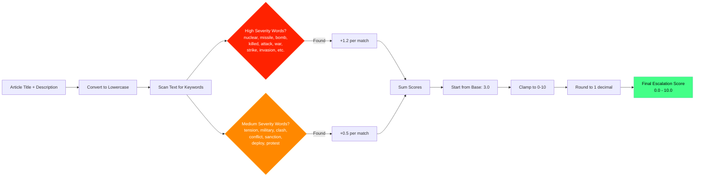
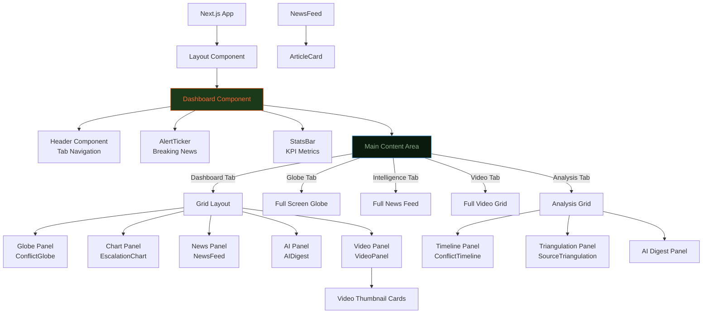

# WCI System Architecture

```mermaid
flowchart TB
    %% Data Sources
    RSS[RSS News Feeds<br/>BBC, Al Jazeera, Reuters,<br/>Guardian, DW, RFI, France 24]
    YT[YouTube Channels<br/>BBC News, Al Jazeera,<br/>DW News, France 24, WION, TRT]
    
    %% API Routes
    NewsAPI[/api/news<br/>GET Request]
    YTAPI[/api/youtube<br/>GET Request]
    
    %% Processing Pipeline
    ParseRSS[RSS Parser<br/>Extract Items]
    ParseYT[YouTube RSS Parser<br/>Extract Videos]
    
    %% Analysis Functions
    ClassifyTags[classifyTags<br/>Match keywords to<br/>conflict tags]
    ClassifyRegion[classifyRegion<br/>Map tags to regions]
    AnalyzeSentiment[analyzeSentiment<br/>Scan for positive/negative<br/>keywords]
    ComputeEscalation[computeEscalationScore<br/>Base: 3.0<br/>+1.2 per HIGH word<br/>+0.5 per MED word<br/>Clamp to 0-10]
    
    %% Data Processing
    Dedupe[Deduplicate Articles<br/>By title similarity]
    Filter[Filter by Tag/Region<br/>if query params]
    Sort[Sort by Date]
    
    %% Frontend Components
    Dashboard[Dashboard Component<br/>Main Container]
    SWR[SWR Hooks<br/>Auto-refresh every 2-5min]
    
    %% UI Tabs
    TabDash[Dashboard Tab<br/>Multi-panel view]
    TabGlobe[Globe Tab<br/>3D visualization]
    TabNews[Intelligence Tab<br/>News feed]
    TabVideos[Video Tab<br/>YouTube clips]
    TabAnalysis[Analysis Tab<br/>Timeline & Triangulation]
    
    %% Display Components
    NewsFeed[NewsFeed Component<br/>Filterable article list]
    ArticleCard[ArticleCard<br/>Shows escalation score,<br/>sentiment, tags]
    VideoPanel[VideoPanel<br/>Grid of video thumbnails]
    ConflictGlobe[ConflictGlobe<br/>3D Globe with zones]
    EscalationChart[EscalationChart<br/>24H timeline]
    AIDigest[AIDigest<br/>AI summary widget]
    ConflictTimeline[ConflictTimeline<br/>Chronological events]
    SourceTriangulation[SourceTriangulation<br/>Multi-source analysis]
    
    %% Data Flow
    RSS --> NewsAPI
    YT --> YTAPI
    
    NewsAPI --> ParseRSS
    ParseRSS --> ClassifyTags
    ClassifyTags --> ClassifyRegion
    ClassifyTags --> AnalyzeSentiment
    ClassifyTags --> ComputeEscalation
    
    ComputeEscalation --> Dedupe
    Dedupe --> Filter
    Filter --> Sort
    Sort --> NewsAPI
    
    YTAPI --> ParseYT
    ParseYT --> ClassifyTags
    ParseYT --> YTAPI
    
    NewsAPI --> SWR
    YTAPI --> SWR
    SWR --> Dashboard
    
    Dashboard --> TabDash
    Dashboard --> TabGlobe
    Dashboard --> TabNews
    Dashboard --> TabVideos
    Dashboard --> TabAnalysis
    
    TabDash --> NewsFeed
    TabDash --> ArticleCard
    TabDash --> ConflictGlobe
    TabDash --> EscalationChart
    TabDash --> AIDigest
    TabDash --> VideoPanel
    
    TabGlobe --> ConflictGlobe
    
    TabNews --> NewsFeed
    NewsFeed --> ArticleCard
    
    TabVideos --> VideoPanel
    
    TabAnalysis --> ConflictTimeline
    TabAnalysis --> SourceTriangulation
    TabAnalysis --> AIDigest
    
    %% Styling
    classDef api fill:#1a3a1a,stroke:#44aaff,stroke-width:2px,color:#8aaa8a
    classDef process fill:#0a1a0c,stroke:#ff4400,stroke-width:2px,color:#ff6633
    classDef ui fill:#060f07,stroke:#44ff88,stroke-width:2px,color:#aaccaa
    classDef data fill:#030805,stroke:#ffaa00,stroke-width:2px,color:#ffcc44
    
    class RSS,YT data
    class NewsAPI,YTAPI api
    class ParseRSS,ParseYT,ClassifyTags,ClassifyRegion,AnalyzeSentiment,ComputeEscalation,Dedupe,Filter,Sort process
    class Dashboard,SWR,TabDash,TabGlobe,TabNews,TabVideos,TabAnalysis,NewsFeed,ArticleCard,VideoPanel,ConflictGlobe,EscalationChart,AIDigest,ConflictTimeline,SourceTriangulation ui
```

## Severity Calculation Flow



## Component Hierarchy


